Progetto d'esame del corso di Programmazione Web
============================
***Matteo Ferfoglia - Anno Accademico: 2019-2020***

\
Questa *repository* contiene tutti i codici sorgente relativi al
Progetto d'esame del Corso di *Programmazione Web* per l'Anno Accademico
2019-2020.

Il progetto si compone di tre parti:
1. ***Java Web Application*** che costituisce il *back-end* del progetto e di
   cui viene eseguito il *deploying* nel *web server*, con il compito di accedere
   al *database* e soddisfare le richieste *HTTP* dei *client*;
2. ***Applicazione Vue.js*** che implementa l'interfaccia grafica
   visibile agli utenti che voglio accedere alla piattaforma tramite browser e
   si occupa della rappresentazione dei dati ricevuti dal *web server*;
3. ***Client REST***, implementato in *Java*, come da requisiti.

I dettagli di ognuna delle tre parti sono esplicitati nei file *README.md*
presenti nelle rispettive cartelle.

La cartella ***\_\_EXTRA__*** contiene file aggiuntivi, tra cui i requisiti di
progetto e la spiegazione di alcuni algoritmi utilizzati.

## Screenshots
La *web-application* è stata realizzata con l'approccio *responsive*, cosicché
l'interfaccia grafica possa adattarsi alle dimensioni dello schermo.
Di seguito sono riportati alcuni screenshot esemplificativi.

### Form di login
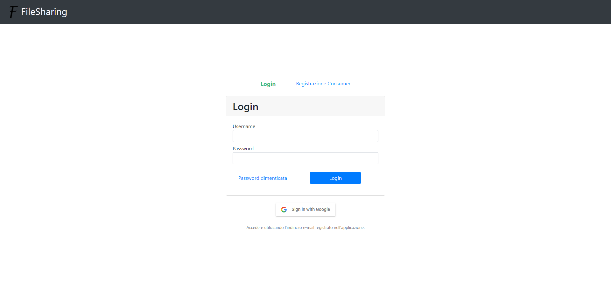

Form di login, visto da smartphone
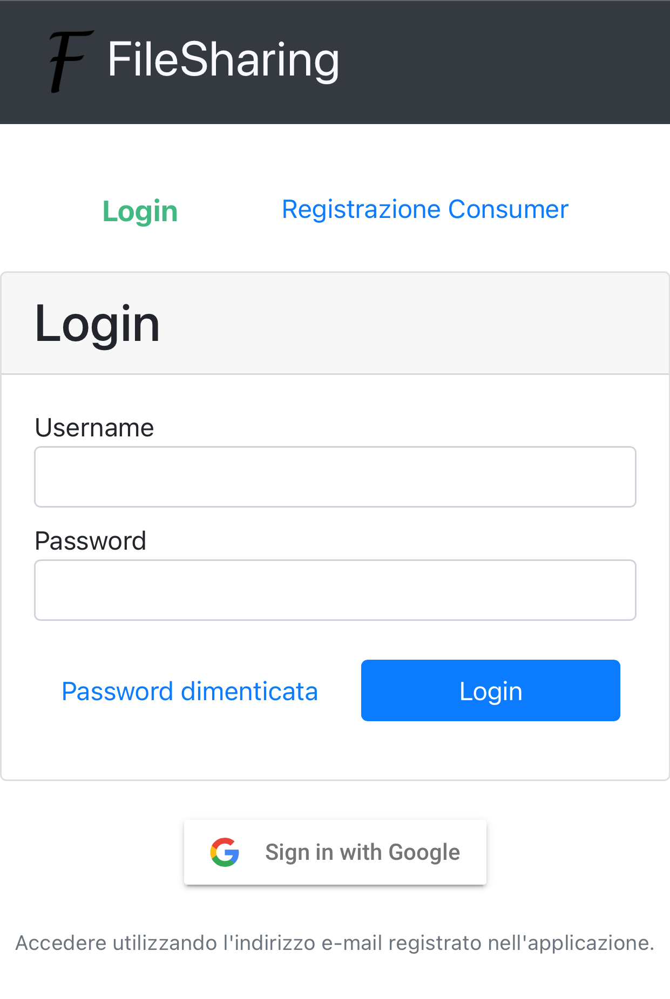

### Form di registrazione
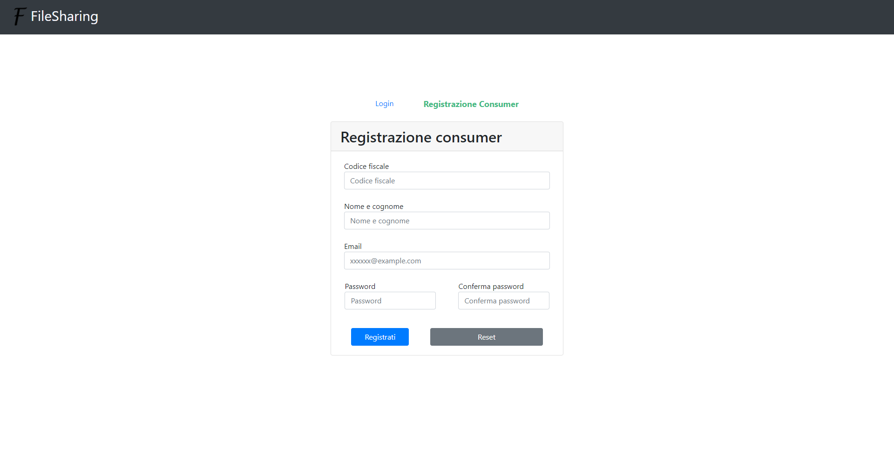

### Area riservata

- #### Area riservata Di un *Administrator*
Nella schermata principale, un *Administrator* può vedere sia la lista degli
*Administrator* sia quella degli *Uploader*, con la possibilità di crearne di
nuovi, e può selezionarli per vederne la scheda contenente le informazioni 
dettagliate, con la possibilità di modificarle.
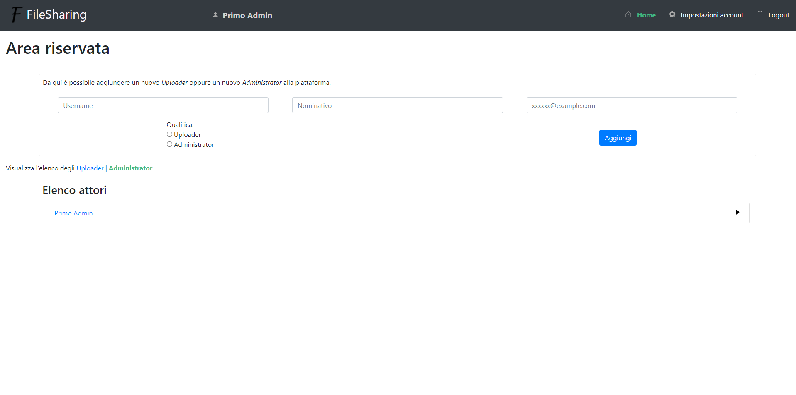

- #### Area riservata Di un *Uploader*
##### Schermata Principale
Nella schermata principale, un *Uploader* vede una lista di *Consumer* per i
quali ha caricato dei documenti, con la possibilità di aggiurne di nuovi o
di eliminarne alcuni. Cliccando su un *Consumer*, vede le sue informazioni,
con la possibilità di modificarle, e la lista dei documenti caricatigli.
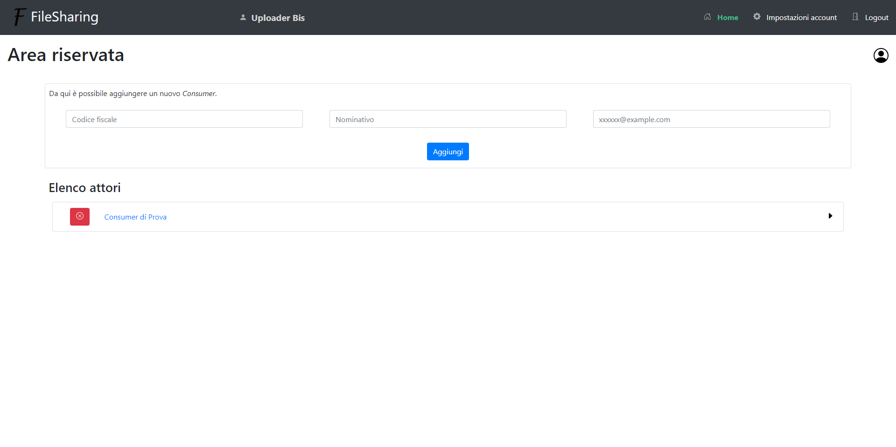

Vista da smartphone:
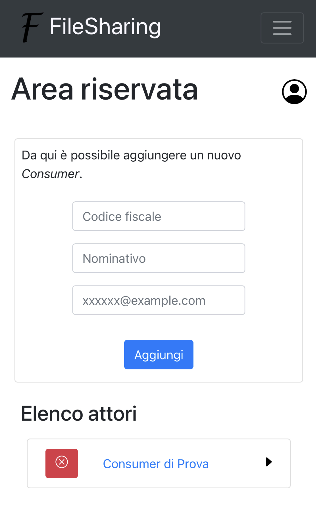

##### Scheda di un *Consumer* servito dall'*Uploader* e lista dei documenti caricati
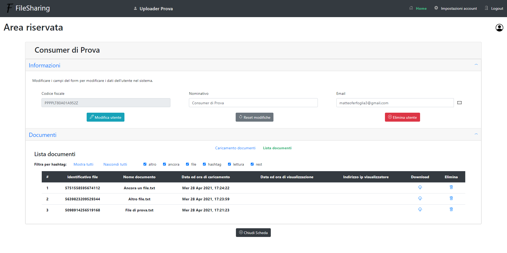

##### Pagina delle impostazioni dell'account
Ogni attore può modificare le impostazioni del proprio account.
Questo *screenshot* è relativo alla schermata di un *Uploader*,
ma anche gli altri attori ne vedono una analoga.
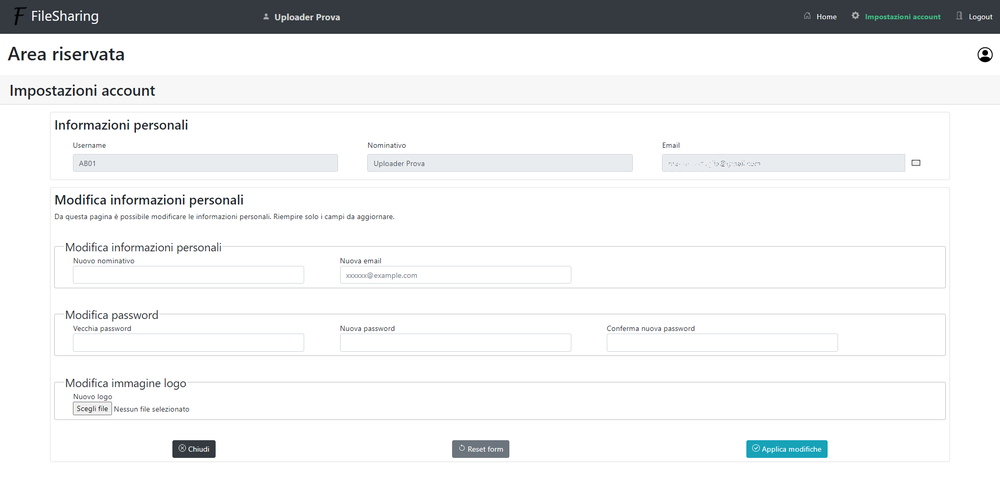

- #### Area riservata Di un *Consumer*
##### Schermata Principale
Se un *Consumer* ha ricevuto dei documenti da più *Uploader*, allora nella
schermata principale vede l'elenco degli *Uploader* che gli hanno inviato
almeno un documento.
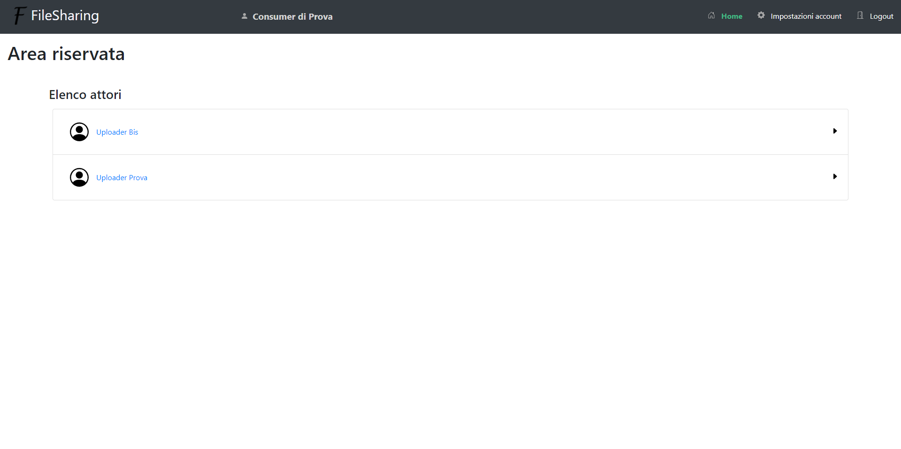

Stessa vista, da smartphone:
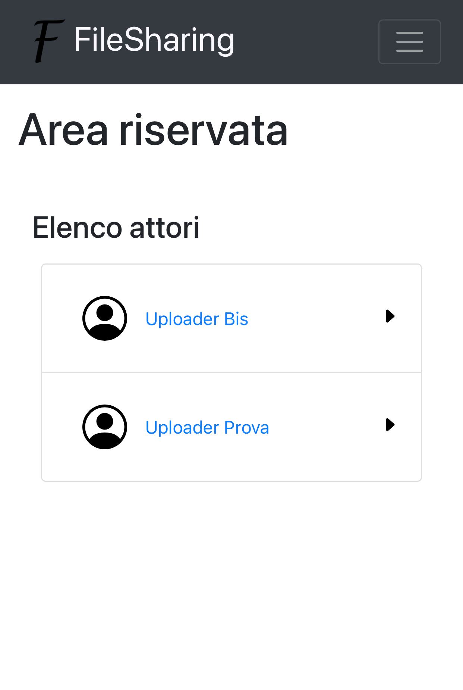
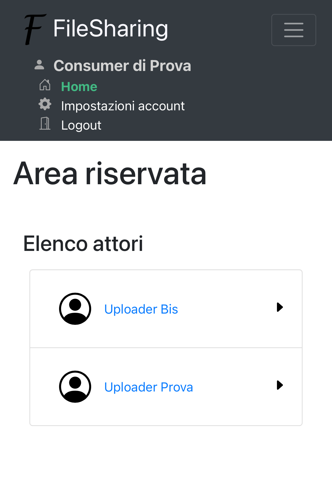

Se un *Consumer* (nel seguente esempio, di nome 'Consumer di Prova') ha ricevuto 
dei documenti solo dall'*Uploader* (nell'esempio, 'Uploader Prova'), allora nella
schermata principale vede direttamente la lista dei documenti, ordinata sulla
data di visualizzazione, con i documenti non visualizzati davanti.
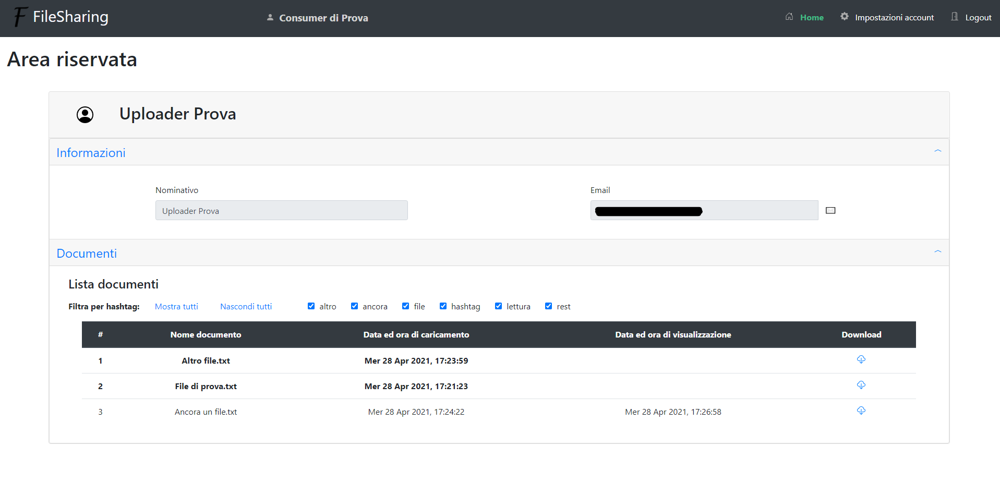

Esempio della lista di documenti, vista da smartphone:
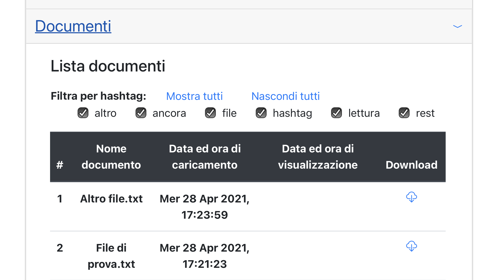

##### Pagina delle impostazioni dell'account
Questa pagina, vista da smartphone, è relativa ad un *Consumer*, ma è analoga anche per gli altri attori.
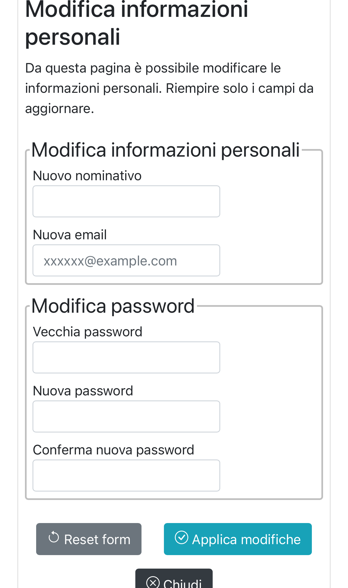

### Esempio di utilizzo del client REST
Un *Uploader* può utilizzare il *client REST* (dal terminale) per l'invio
di un documento ad un *Consumer*. In questo esempio è l'*Uploader* con
username *AB01* a caricare un documento nel sistema.
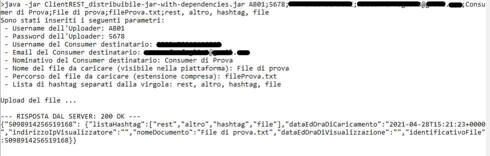